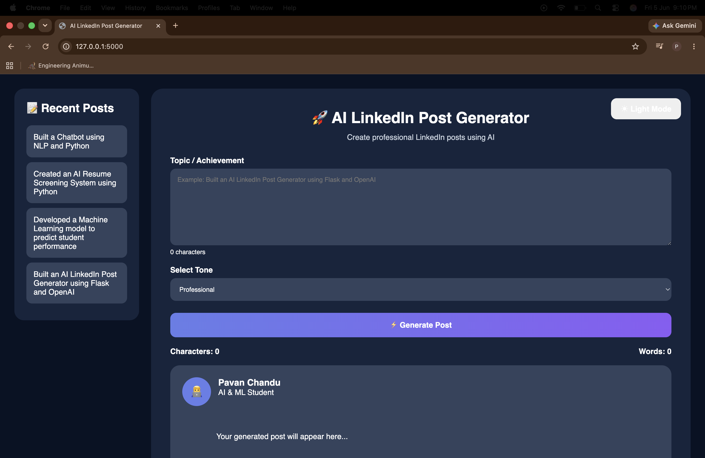
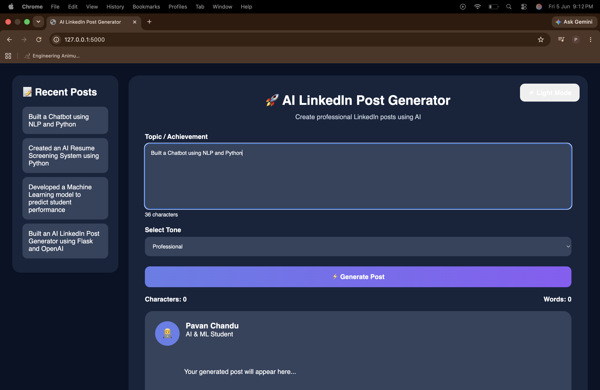
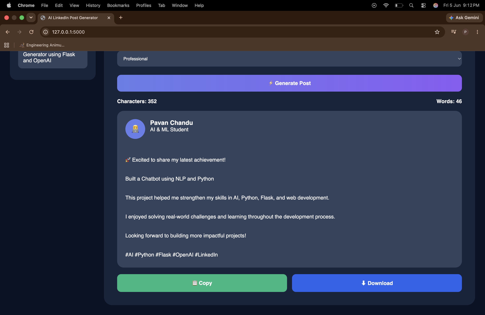

# 🚀 AI LinkedIn Post Generator

A modern web application that generates professional LinkedIn posts from user-provided achievements, projects, and topics.

The application provides multiple writing tones, a responsive user interface, dark/light mode, recent post history, copy functionality, and downloadable generated posts.

---

## ✨ Features

- AI-powered LinkedIn post generation
- Professional, Inspirational, Casual, and Storytelling tones
- Modern responsive UI
- Dark Mode / Light Mode
- Character Counter
- Word Counter
- Recent Posts Sidebar
- Copy Post to Clipboard
- Download Generated Post
- Flask Backend API
- Mobile Friendly Design

---

## 🛠️ Technologies Used

### Frontend
- HTML5
- CSS3
- JavaScript

### Backend
- Python
- Flask
- Flask-CORS

### AI Integration
- OpenAI API (Optional)
- Template-Based Fallback Generator

---

## 📂 Project Structure

```text
ai-linkedin-post-generator/
│
├── backend/
│   ├── app.py
│   ├── ai_service.py
│   ├── prompt_builder.py
│   └── validators.py
│
├── frontend/
│   ├── index.html
│   ├── style.css
│   ├── script.js
│   └── README.md
│
├── static/
│   ├── style.css
│   ├── script.js
│   ├── icons/
│   └── images/
│
├── templates/
│   └── index.html
│
├── tests/
│   ├── test_api.py
│   └── test_prompt.py
│
├── screenshots/
│   ├── home-page.png
│   ├── input-page.png
│   ├── dark-mode.png
│   └── generated-post.png
│
├── requirements.txt
├── README.md
└── .gitignore
```

---

## 📸 Screenshots

### 🏠 Home Page



---

### ✍️ Topic Input



---

### 🌙 Dark Mode


---

### 📄 Generated LinkedIn Post



---

## ⚙️ Installation

### Clone Repository

```bash
git clone https://github.com/pavanchandu9347/ai-linkedin-post-generator.git
```

### Navigate to Project

```bash
cd ai-linkedin-post-generator
```

### Create Virtual Environment

```bash
python3 -m venv .venv
```

### Activate Environment

#### macOS/Linux

```bash
source .venv/bin/activate
```

#### Windows

```bash
.venv\Scripts\activate
```

### Install Dependencies

```bash
pip install -r requirements.txt
```

### Run Application

```bash
cd backend
python3 app.py
```

### Open Browser

```text
http://127.0.0.1:5000
```

---

## 🎯 Example Topics

- Built a Chatbot using NLP and Python
- Created an AI Resume Screening System
- Developed a Machine Learning Model for Student Performance Prediction
- Built an AI LinkedIn Post Generator using Flask and OpenAI
- Created a Face Recognition Attendance System

---

## 🔮 Future Enhancements

- AI Hashtag Suggestions
- Post Templates
- Export as PDF
- User Authentication
- Save Generated Posts
- LinkedIn Direct Sharing
- Post Scheduling

---

## 👨‍💻 Author

### Kuriti Pavan Chandu

- B.Tech (Artificial Intelligence & Machine Learning)
- Aditya Engineering College

GitHub:

https://github.com/pavanchandu9347

---

## ⭐ Support

If you found this project useful:

⭐ Star the repository

🍴 Fork the repository

📢 Share it with others

---

### Thank You for Visiting!